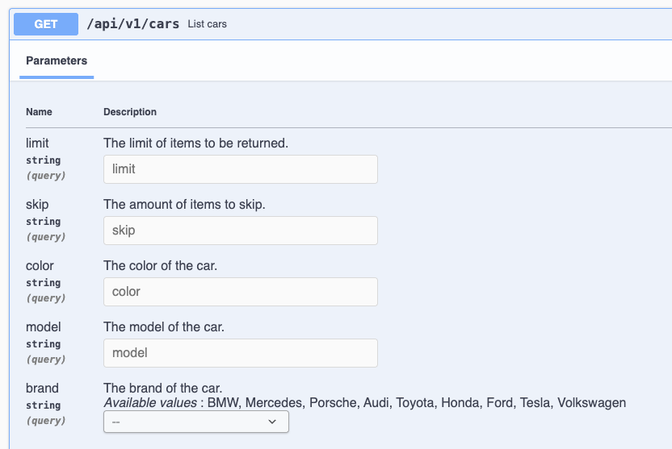

# tRPC + NestJS + Next.js + Swagger Demo

A full-stack demo showcasing **end-to-end type safety** between backend and frontend using tRPC, with improved Swagger documentation generation using Zod. This project aims to serve as a **starter template** for building modern full-stack applications.

[](https://opensource.org/licenses/MIT)

## 🚀 Features

- **End-to-end type safety** — No manual API client code, types are inferred from the backend
- **Swagger API docs** — Automatically generated for third-party integrations
- **Backend validation** — Zod schemas validate all API requests and generate Swagger docs
- **Pagination & CRUD demo** — Example car listing with create, update, delete, and pagination
- **Modern UI** — Styled with Ant Design and TailwindCSS
- **Monorepo architecture** — Shared enum constants and utilities between backend and frontend

## 🏗️ Architecture

This demo addresses the following use case:

> You need an API that serves a frontend application **and** integrates with third-party systems over HTTP.


## 🚗 What This Demo Does

This project demonstrates a **car dealership management system** with full CRUD operations accessible through both RESTful APIs and tRPC endpoints. Here's what you can do:

### Backend API (NestJS)
- **RESTful Endpoints** at `/api/v1/cars`:
  - `GET /cars` - List cars with filtering, pagination, and sorting
  - `POST /cars` - Create a new car
  - `GET /cars/:id` - Get a specific car by ID
  - `PUT /cars/:id` - Update a car
  - `DELETE /cars/:id` - Delete a car

- **tRPC Endpoints** at `/trpc`:
  - Same CRUD operations but with full type safety
  - Compile-time type inference between client and server

### Frontend (Next.js)
- **Modern UI** built with Ant Design and TailwindCSS
- **Type-safe API calls** using tRPC client
- **Type inference** from backend schemas for development

### Key Features Demonstrated
- **Dual API Access**: Same data accessible via REST (for third-party integrations) and tRPC (for frontend)
- **Type Safety**: End-to-end type safety via tRPC type inference
- **Backend Validation**: Zod schemas validate all API requests and generate Swagger docs
- **Documentation**: Auto-generated Swagger docs for REST endpoints

## 🛠️ Tech Stack

- **Backend:** [NestJS](https://nestjs.com/) with tRPC and Swagger
- **Frontend:** [Next.js](https://nextjs.org/) (App Router) with tRPC client
- **Type Inference:** Compile-time type safety via tRPC
- **Package Manager:** [pnpm](https://pnpm.io/)
- **UI:** [Ant Design](https://ant.design/) with TailwindCSS

## 📁 Project Structure

```
trpc-nestjs-nextjs-demo/
├── apps/
│   ├── api/                    # NestJS backend
│   │   ├── src/
│   │   │   ├── common/         # Shared utilities, decorators, DTOs
│   │   │   ├── modules/        # Feature modules (cars, trpc)
│   │   │   └── main.ts         # Application bootstrap
│   │   └── swagger.yml         # Generated Swagger spec
│   └── web/                    # Next.js frontend
│       ├── src/
│       │   ├── app/            # App Router pages
│       │   └── _trpc/          # tRPC client setup
│       └── package.json
└── packages/
    └── shared/                 # Shared consts & enums
        └── src/
            └── index.ts        # CarBrand enum, etc.
```

## 🚀 Quick Start

### Prerequisites

Make sure you have **pnpm** installed globally:

```bash
npm install -g pnpm
```

### Installation

```bash
# 1. Clone the repository
git clone https://github.com/williamwinkler/trpc-nestjs-nextjs-demo.git

# 2. Enter the project folder
cd trpc-nestjs-nextjs-demo

# 3. Install dependencies
pnpm install

# 4. Start the development environment
pnpm dev
```

### Using as a Starter Template

This project is designed to be used as a **starter template** for new full-stack applications. To use it as a base for your next project:

1. **Fork or clone** this repository
2. **Replace the car dealership logic** with your own business domain
3. **Update the shared enums** in `packages/shared/src/index.ts`
4. **Modify the DTOs** in `apps/api/src/modules/` to match your data models
5. **Customize the UI** in `apps/web/src/app/` for your use case

The project includes all the essential patterns and configurations you need for a production-ready application with type safety, API documentation, and modern development practices.

## 📜 Available Scripts

- `pnpm dev` - Start both API and frontend in development mode
- `pnpm dev:api` - Start only the API server
- `pnpm dev:web` - Start only the frontend

## 🔧 Swagger Documentation

This project uses **Zod** as the single source of truth for all DTOs and validation rules. With [`nestjs-zod`](https://github.com/colinhacks/zod) and custom decorators, we can:

- Define DTOs **once** in Zod
- Automatically generate **NestJS DTO classes** for Swagger
- Validate **query parameters** and **path parameters**
- Keep Swagger docs **in sync** with runtime validation

### 1. Defining DTOs with Zod

```ts
import { createZodDto } from "nestjs-zod";
import { z } from "zod";
import { CarBrandType } from "@repo/shared";

export const carBrandSchema = z
  .nativeEnum(CarBrand)
  .describe("The brand of the car.");

export const carModelSchema = z
  .string()
  .min(1, "Model name is required")
  .max(100, "Model name must be at most 100 characters long")
  .describe("The model of the car.");

export const createCarSchema = z.object({
  brand: carBrandSchema,
  model: carModelSchema,
  year: z.number().int().gte(1886),
  color: z.string(),
  kmDriven: z.number().int().gte(0),
  price: z.number().min(0),
});

export class CreateCarDto extends createZodDto(createCarSchema) {}
```

This gives us:
- **Runtime validation** via Zod
- **TypeScript types** inferred automatically
- **Swagger docs** generated from the DTO

### 2. Using DTOs in Controllers

```ts
@Post()
@ApiOperation({ summary: "Create a car" })
@ApiCreatedResponse({
  type: ApiResponseDto(CarDto),
  description: "Car created successfully",
})
create(@Body() dto: CreateCarDto): GeneralResponseDto<CarDto> {
  const car = this.carsService.create(dto);
  const data = this.carsAdapter.getDto(car);

  return wrapResponse(data);
}
```

### 3. Validating Query & Path Params

Custom decorators `zQuery` and `zParam` that:
- Validate incoming params with Zod
- Throw a `BadRequestException` on validation errors
- Automatically add the parameter to Swagger docs

```ts
@Get()
@ApiOperation({ summary: "List cars" })
@ApiOkResponse({ type: ApiResponseListDto(CarDto) })
@BadRequest()
findAll(
  @zQuery("brand", carBrandSchema.optional()) brand?: CarBrandType,
  @zQuery("model", carModelSchema.optional()) model?: string,
  @zQuery("color", carColorSchema.optional()) color?: string,
  @zQuery("skip", skipSchema.optional()) skip = 0,
  @zQuery("limit", limitSchema.optional()) limit = 20,
): GeneralResponseDto<PaginationDto<CarDto>> {
  const cars = this.carsService.findAll({ brand, model, skip, limit, color });
  const data = this.carsAdapter.getListDto(cars);

  return wrapResponse(data);
}
```

These query params will then automatically show up in Swagger like so:



### 4. Dynamic Swagger DTOs for Responses

```ts
// For single item responses
export function ApiResponseDto<T>(classRef: new () => T) {
  return createResponseDto(classRef);
}

// For paginated list responses
export function ApiResponseListDto<T>(classRef: new () => T) {
  return createResponseListDto(classRef);
}
```

These utilities:
- Create **unique class names** for Swagger schema generation
- Ensure all responses follow a **consistent format**
- Show the **exact shape** of the response, including pagination metadata

### 5. Consistent Response DTO Shape

All API responses follow a consistent structure for better integration and documentation:

#### Single Item Response
```json
{
  "apiVersion": "string",
  "data": {
    // Resource data object
  }
}
```

#### Paginated List Response
```json
{
  "apiVersion": "string",
  "data": {
    "meta": {
      "total": "number",
      "limit": "number",
      "skipped": "number",
      "count": "number"
    },
    "items": [
      // Array of resource objects
    ]
  }
}
```

### 6. Swagger Configuration

The project generates Swagger documentation in all environments:

```ts
// main.ts
// Always generate Swagger documentation for external tools
const config = new DocumentBuilder()
  .setTitle("🔥 Next Gen Nestjs API")
  .setDescription(pkg.description)
  .setVersion(pkg.version)
  .build();

const document = SwaggerModule.createDocument(app, config);

// Generate YAML file for external tools (always)
const yamlString = YAML.stringify(document);
writeFileSync("swagger.yml", yamlString);

// Only serve Swagger UI in development
if (process.env.NODE_ENV === "development") {
  SwaggerModule.setup("docs", app, document);
}
```

This provides:
- **YAML export** for external tools and documentation (always generated)
- **Interactive API documentation** at `/docs` (development only)
- **Automatic schema generation** from Zod schemas

## 🤔 Why Monorepo?

Using a monorepo allows:

- **Shared enum constants** between backend and frontend (e.g., `CarBrand` enum)
- **Single source of truth** for shared constants
- Easier refactoring and dependency management

## 📄 License

MIT
